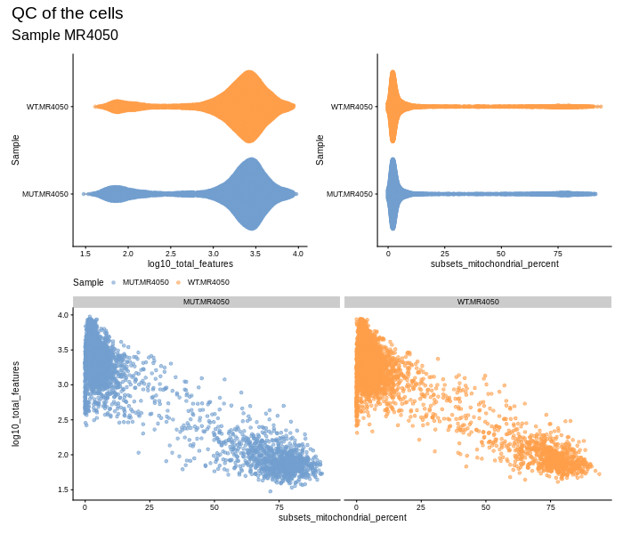
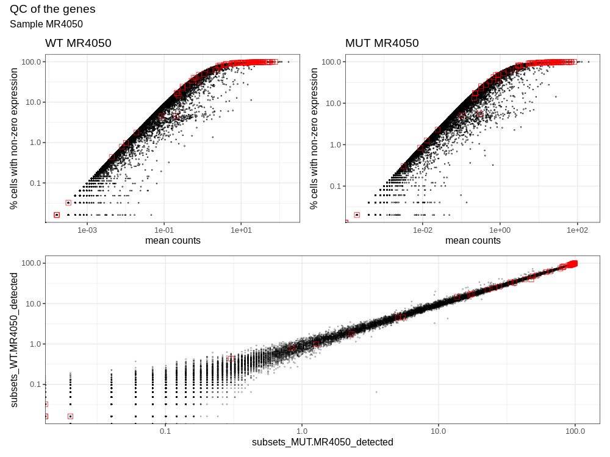
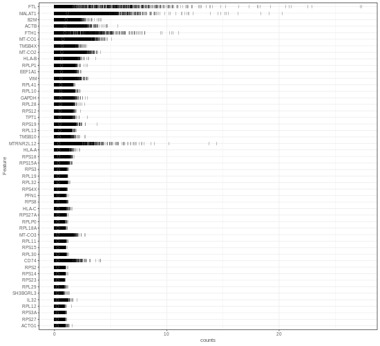
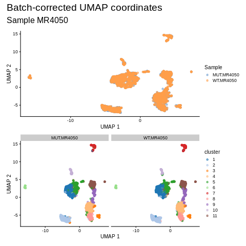

```{r setup, include = FALSE}
knitr::opts_chunk$set(
  collapse = TRUE,
  comment = "#>",
  eval=TRUE, cache=TRUE
)
```

# Background

There are two types of samples from previously *in vitro* sensitized T cells to be compared here:

* T cells presented with the **irrelevant** antigen (named "WT" from here on), and
* T cells presented with the **tumor antigen** (named "MUT")

Both samples contain a mixture of T cells and APC, although the ratio is skewed heavily towards T cells (approximately 10:1).

All samples were processed at the Epigenomics Core (WCM) using the Chromium Single Cell Immune Profiling Solution.
This method allows to obtain both the gene expression profile and T-cell receptor repertoires from the same input sample.
In short, for each input sample, a single batch of barcoded droplets was created followed by cDNA library generation for each cell.
After cDNA amplification, each sample was split into two aliquots, of which one was subjected to T cell enrichment (`Chromium Human T Cell`).
Both aliquots were then sequenced separately, yielding two distinct libraries from the same input samples (identified with separate I7 indices).
Using the `CellRanger` package supplied by 10X Genomics, the Epigenomics Core created two files per sample:

* a count matrix of transcript counts per gene and cell, and
* a table of TRA/TRB clonotypes per cell.

The pipeline includes read alignment to the human genome and removal of barcodes with very low read counts.
The annotation files that were used were `vdj_GRCh38_alts_ensembl-5.0.0` and `refdata-gex-GRCh38-2020-A`. 

The Epigenomics Core ID is: `EC-SC-6638`, which will allow the retrieval of the original `CellRanger` output.

## Data processing

Our data processing encompassed additional quality checks and removal of genes and cells with aberrant transcript numbers and lack of VDJ information.

## Summary

```{r cache=FALSE}
#library(KlebanoffMR4050)
devtools::load_all()
data(cell_filt)
data(gene_filt)
```


The count matrix provided by Cell Ranger contained  `r print(gene_filt$ori)` genes x `r print(cell_filt$ori)` cells.

1. removed genes without single read in any of the cells
2. removed cells with `subsets_mitochondrial_percent` >= 14%: `r print(cell_filt$mito)`
2. removed cells with fewer than 1000 genes (`log10_total_features`): `r print(cell_filt$n_features)`
3. removed cells without clonotype information: `r print(cell_filt$clonotype)`
4. removed cells with 2 or more TRB or TRA clonotypes (= doublets): `r print(cell_filt$clonotype_doubs)`
5. removed genes that were detected in fewer than 5 cells per condition: `r print(gene_filt$clonotype_doubs_min5)` genes

Final DGE matrix with TRA/TRB information for each cell: `r print(gene_filt$clonotype_doubs_min5)` genes x `r print(cell_filt$clonotype_doubs)` cells (across both samples).

# Processing

## Reading in

Reading in the count matrices and VDJ results as provided by `CellRanger`.

```{r libraries, message=FALSE, warning=FALSE}
library(data.table)
library(magrittr)
library(SingleCellExperiment)  
library(ggplot2); theme_set(theme_bw(base_size = 16) )
library(ggrepel)
library(patchwork)
library(kableExtra)
samplename <- "MR4050"
```


```{r readingIn, eval=FALSE}
cell_filt <- list()
gene_filt <- list()

## CLONOTYPE INFO ===========================
#$~/miniconda3/envs/newR/bin/R
data_dir <- "/scratchLocal/frd2007/2018-11_Smita_Tcells/data/MR4050/"
## stored within the tar.gz generated with CellRanger and downloaded from PubShare
clono_info_wt <- reading_in_clonotypes(paste0(data_dir,"MR4050_WT-TCR/")) 
clono_info_mut <- reading_in_clonotypes(paste0(data_dir,"MR4050_Mut-TCR/")) 

## READ COUNTS ==============================
# list.files(dir.name) # "barcodes.tsv" "genes.tsv"    "matrix.mtx"
wt <- paste0(data_dir, "MR4050_WT-GEX/outs/filtered_feature_bc_matrix")
mut <- paste0(data_dir, "MR4050_Mut-GEX/outs/filtered_feature_bc_matrix")

file.exists(wt)
file.exists(mut)

sce.wt <- DropletUtils::read10xCounts(wt, 
  sample.names = paste("WT", samplename, sep = "."),
  version = "auto")
sce.wt$cell <- paste(sce.wt$Sample, 1:ncol(sce.wt), sep = "_")
colnames(sce.wt) <- sce.wt$cell

sce.mut <- DropletUtils::read10xCounts(mut, 
  sample.names = paste("MUT", samplename, sep = "."),
  version = "auto")
sce.mut$cell <-  paste(sce.mut$Sample, 1:ncol(sce.mut), sep = "_")
colnames(sce.mut) <- sce.mut$cell

## prepare cell info 
ci.wt <- prep_cell_info(sce.wt, clono_info_wt)
ci.mut <- prep_cell_info(sce.mut, clono_info_mut)

## COMBINE ------------------------------------
cts <- cbind(counts(sce.mut), counts(sce.wt)) ## keep order!
cell_filt$ori <- ncol(cts)
gene_filt$ori <- nrow(cts)

## combine colData
cd <- rbind(ci.mut, ci.wt)
cd <- cd[colnames(cts),]

## rowData prep
gene_info <- rowData(sce.mut)[, c(1:2)]
names(gene_info) <- c("ensembl_id","gene_symbol")

## make SCE object --------------------------------------------
sce <- SingleCellExperiment(assays = list(counts = cts),
  colData = cd,
  rowData = gene_info[rownames(cts),])

## remove genes with only zero counts----------------------------
keep <- rowSums(counts(sce)) > 0 
sce <- sce[keep,]
dim(sce)
# [1] 25419 14077
gene_filt$first_all_zeros <- nrow(sce)

## ADD CHROMOSOME INFO & CELL QC METRICS -------------------
sce <- get_mito(sce)
is.mito <- rowData(sce)$chr == "chrMT";  is.mito[is.na(is.mito)] <- FALSE
sce <- add_cell_qc(sce, is.mito)
##! saveRDS(sce, file = paste("sce", samplename, "unfiltered.rds", sep = "_"))
```


## Remove low-quality cells

```{r cellEval, eval=FALSE}
png(paste0(samplename,"_qc_per_cell.png"), height = 600, width = 700)
p1 <- scater::plotColData(sce, 
  y = "Sample", x = "log10_total_features",
  colour_by = "Sample") +
  theme(legend.position = "bottom") +
  scale_fill_manual(values = c("dodgerblue1","limegreen"))

p2 <- scater::plotColData(sce, 
  y = "Sample", x = "subsets_mitochondrial_percent",
  colour_by = "Sample") +
  theme(legend.position = "none")+
  scale_fill_manual(values = c("dodgerblue1","limegreen"))

p3 <- scater::plotColData(sce,
  y = "log10_total_features", x = "subsets_mitochondrial_percent",
  colour_by = "Sample",  other_fields = "Sample") +
  facet_grid(~Sample) +
  theme(legend.position = "none")+
  scale_fill_manual(values = c("dodgerblue1","limegreen"))

pw <- (p1 | p2 ) / p3
pw + plot_annotation(title = 'QC of the cells' ,
    subtitle = paste("Sample", samplename))
dev.off()
```

```{r cellFiltering, eval=FALSE}
options(stringsAsFactors = FALSE)
sce.filt <- sce
rm(sce); gc()
## Mito content ---------------------------------------------------------
high.mito <- scater::isOutlier(sce.filt$subsets_mitochondrial_percent, nmads = 5, type = "higher")
sce.filt[, !high.mito]$subsets_mitochondrial_percent %>% max
# [1] 13.09579

### manually defined mitochondrial threshold: 13%
high.mito <- sce.filt$subsets_mitochondrial_percent >= 13
sce.filt <- sce.filt[, !high.mito]
cell_filt$mito <- ncol(sce.filt)

## Number of genes per cell--------------------------------------------
outlier.genes <- scater::isOutlier(sce.filt$detected, nmads = 3, type = "both")
sce.filt[, !outlier.genes]$log10_total_features  %>% summary
#  Min. 1st Qu.  Median    Mean 3rd Qu.    Max. 
#  2.314   3.269   3.407   3.384   3.527   3.784 

## Given the QC plot where a subset of low-gene cells also has zero mitochondrial genes,
## I'll set the threshold to 3

sce.filt <- sce.filt[, sce.filt$log10_total_features >= 3]
# [1]  25419 11157
cell_filt$n_features <- ncol(sce.filt)

## immediately remove no-coverage-genes --------------------------------------
keep <- rowSums(counts(sce.filt)) > 0
sce.filt <- sce.filt[keep,]

dim(sce.filt)
#[1] 20328 10243
gene_filt$low_qual_cells <- nrow(sce.filt)

## CELL CYCLE STATUS ---------------------------------------------------------
cc.noNormAllCells <- get_cc_info(sce.filt, print_results = TRUE)

colData(sce.filt)$cc_phase <- cc.noNormAllCells$phases
colData(sce.filt)$G1score <- cc.noNormAllCells$score$G1
colData(sce.filt)$G2Mscore <- cc.noNormAllCells$score$G2M

table(sce.filt$cc_phase)
#  G1  G2M    S 
# 6157  908 4092 
table(sce.filt$cc_phase, sce.filt$Sample)
#       MUT.MR4050 WT.MR4050
#  G1        2821      3336
#  G2M        354       554
#  S         1785      2307


## make more sensible rownames ---------------------------
rownames(sce.filt) <- scater::uniquifyFeatureNames(
  rowData(sce.filt)$ensembl_id,
  rowData(sce.filt)$gene_symbol)

!##saveRDS(sce.filt, file = paste("sce", samplename,"filtered.rds", sep = "_"))
```

Counts & genes per cell before filtering:




## QC & Filtering of Genes


```{r geneFiltering, eval=FALSE}
## calculate qc metrics per gene across all the cells of the same sample
gnqc.list <- do_gene_qc(sce.filt, return_df = TRUE)
gn.qc <- gnqc.list$gene_qc

png(paste0(samplename,"_qc_genes.png"), width=1000, height = 750)
p1 <- ggplot(data = data.frame(gn.qc), aes(x = subsets_WT.MR4050_mean,
  y = subsets_WT.MR4050_detected)) + 
  geom_point(shape=1, size=.5) +
  ggtitle(paste("WT", samplename)) +
  scale_x_log10() + scale_y_log10() +
  ylab("% cells with non-zero expression") + xlab("mean counts")
p1 <- p1 + 
  geom_point(data = subset(data.frame(gn.qc), Gene %in% gnqc.list$hk_genes), 
    color = "red",shape = 22, size = 4) 

p2 <- ggplot(data = data.frame(gn.qc), aes(x = subsets_MUT.MR4050_mean,
  y = subsets_MUT.MR4050_detected)) + geom_point(shape=1, size=.5) + 
  ggtitle(paste("MUT", samplename)) +
  scale_x_log10() + scale_y_log10() +
  ylab("% cells with non-zero expression") + xlab("mean counts")
p2 <- p2 + 
  geom_point(data = subset(data.frame(gn.qc), Gene %in% gnqc.list$hk_genes), 
    color = "red",shape = 22, size = 4) 

p3 <- ggplot(data = data.frame(gn.qc),
  aes(x = subsets_MUT.MR4050_detected, y = subsets_WT.MR4050_detected)) +
  geom_point(shape=1, size=.5, alpha =.5) +
  scale_x_log10() + scale_y_log10()
p3 <- p3 +
  geom_point(data = subset(data.frame(gn.qc), Gene %in% gnqc.list$hk_genes), 
    color = "red",shape = 22, size = 4) 
pw <- (p1 | p2) / p3
pw + plot_annotation(title = 'QC of the genes' ,
    subtitle = paste("Sample", samplename))
dev.off()

png(paste0(samplename, "_qc_highestExpressedGenes.png"),
    width= 550, height = 500)
scater::plotHighestExprs(sce.filt) 
dev.off()
```

Dropout rate assessment:



Highest expressed genes:



```{r rm_low_qual_genes, eval=FALSE}
keep_genes <-  do_gene_qc(sce.filt, min.cells = 5, return_df = FALSE)
sce.filt <- sce.filt[keep_genes,]

dim(sce.filt)
# > dim(sce.filt)
#[1]  22055 11157
gene_filt$low_qual_genes <- nrow(sce.filt)

!##saveRDS(sce.filt, file = paste0("sce_", samplename,"_filtered.rds"))
```


## Normalization and Dimensionality Reductions

Following filtering, we're going to normalize, adjusting for batch effect (=Sample) and performing dimensionality reduction.

```{r normalization, eval=FALSE}
library(scran)
library(batchelor)
library(scater)

## size factor --------------------------------------
#message("calculating the size factors")
qckclst <- quickCluster(sce.filt, method = "igraph",
  min.mean = 0.1)
sce.filt <- computeSumFactors(sce.filt, min.mean=0.1, cluster = qckclst)
sce.filt <- scater::logNormCounts(sce.filt)
##!saveRDS(sce.filt, file = paste0("sce_", samplename,"_filtered.rds"))

## variance modelling -------------------------------
dec.filt <- modelGeneVar(sce.filt, block=sce.filt$Sample)
chosen.hvgs <- dec.filt$bio > 0
table(chosen.hvgs)
#chosen.hvgs
#FALSE  TRUE 
#13655  8400 

#--- merging ---#
set.seed(01001001)
sce.merged <- correctExperiments(sce.filt, 
    batch=sce.filt$Sample, 
    subset.row=chosen.hvgs)

sce.merged
# class: SingleCellExperiment 
# dim: 8400 11157 
# metadata(2): merge.info pca.info
# assays(3): reconstructed counts logcounts
# rownames(8400): AL627309.5 LINC01409 ... BX004987.1 MAFIP
# rowData names(4): rotation ensembl_id gene_symbol chr
# colnames(11157): MUT.MR4050_1 MUT.MR4050_2 ... WT.MR4050_7677
#   WT.MR4050_7679
# colData names(21): batch Barcode ... G2Mscore sizeFactor
# reducedDimNames(1): corrected
# altExpNames(0):

##! saveRDS(sce.merged, file = paste0("sce_", samplename, "_batchCorrected.rds"))
```


## Remove cells without clonotype information

```{r clonotype_filtering, eval=FALSE}
## REMOVING CELLS WITHOUT CLONOTYPE----------------------------
sce.filt <- sce.filt[,which(!is.na(sce.filt$cdr3s_aa))]
dim(sce.filt)
# [1] 22055  9066
cell_filt$clonotype <- ncol(sce.filt)

## frequencies of chains, i.e. counting number of TRA/TRB entries within cdr3s_aa column
sce.filt <- add_chain_counts(sce.filt)
## frequency of clonotypes, i.e. counting individual cdr3s_aa entries
sce.filt$freq_per_Sample <- add_frequencies(sce.filt, mode = "per.sample")
sce.filt$freq_across_all <- add_frequencies(sce.filt, mode = "all")

## REMOVING PUTATIVE DOUBLETS --------------------------------
png(paste0(samplename, "_relationship_TRB_features.png"), width = 850)
cd <- colData(sce.filt)
p1 <- ggplot(as.data.frame(cd), aes(x = numTRA, 
  y = log10_total_features, color = subsets_mitochondrial_percent)) + 
  ggbeeswarm::geom_quasirandom(size = 1, alpha = .5, shape = 1) +
  theme(legend.position = "bottom") +
  scale_colour_viridis_c()

p2 <- ggplot(as.data.frame(cd), aes(x = numTRB, 
  y = log10_total_features, color = subsets_mitochondrial_percent)) + 
  ggbeeswarm::geom_quasirandom(size = 1, alpha = .5, shape = 1) +
 # ggtitle(" 'Cells' with more than 1 TRB tend to have increased numbers of counts") +
  theme(legend.position = "bottom") +
  scale_colour_viridis_c()

pw <- p1 + p2
pw + plot_annotation(
  title = 'Are multipe TRA/TRB per cell indicative of technical doublets?',
  subtitle = paste("Sample", samplename))
dev.off()

## after looking at these plots, I'm fairly certain that removing cells with more 
## than 2 TRB is benefitial to avoid doublets -- there is a clear shift
## towards increased numbers of features for those cells
sce.filt <- sce.filt[, sce.filt$numTRB < 2 & sce.filt$numTRA < 2]
## remove all-newly-only-zero-genes
keep <- rowSums(as.matrix(counts(sce.filt))) > 0
sce.filt <- sce.filt[keep, ]
cell_filt$clonotype_doubs <- ncol(sce.filt)
gene_filt$clonotype_doubs <- nrow(sce.filt)

dim(sce.filt)
#[1] 21659  7379

keep <- do_gene_qc(sce.filt, min.cells = 5, return_df = FALSE)
sce.filt <- sce.filt[keep, ]
dim(sce.filt)
#[1]  20363  7379
gene_filt$clonotype_doubs_min5 <- nrow(sce.filt)
```

``

## Clustering

```{r clustering, eval=FALSE}
## focus on genes that are actually still part of the filtered
## data set
## note that sce.merged contains all good qual. cells event
## those for which we don't have clonotype information (the
## scRNA-seq info is still valuable!)
kp <- rownames(sce.merged) %in% rownames(sce.filt)
sce.merged <- sce.merged[kp, colnames(sce.filt)]
##  clustering using the batch-corrected values ---------------
g <- buildSNNGraph(sce.merged, use.dimred="corrected")
clusters <- igraph::cluster_louvain(g)
sce.merged$cluster <- factor(clusters$membership)

#--- dimensionality-reduction ---#
sce.merged <- runTSNE(sce.merged, dimred="corrected", external_neighbors=TRUE)
sce.merged <- runUMAP(sce.merged, dimred="corrected", external_neighbors=TRUE)

png(paste0(samplename,"_umap_samples.png"))
p1 <- plotReducedDim(sce.merged, dimred="UMAP", colour_by="Sample") +
    scale_fill_manual(values = c("dodgerblue1","limegreen"))
p2 <- plotReducedDim(sce.merged, dimred="UMAP", colour_by="cluster",
   other_fields = "Sample") +
  facet_grid(~Sample)
pw <- p1 / p2
pw + plot_annotation(title = "Batch-corrected UMAP coordinates", subtitle = paste("Sample", samplename))
dev.off()

##!saveRDS(sce.merged, file = paste0("sce_", samplename, "_batchCorrected.rds"))

## add the red.dim coordinates to the original data set
reducedDims(sce.filt) <- reducedDims(sce.merged)
sce.filt$cluster <- sce.merged$cluster

##! saveRDS(sce.filt, file = paste0("sce_", samplename, "_clonotypefiltered.rds"))
```




# Results

```{r echo=FALSE}
sce.filt <- load_MR4050filt()
```

```{r umap_overview, fig.width = 15, fig.height = 12, cache=TRUE, echo=FALSE, fig.show = "hold"}
goi <- c("Sample","subsets_mitochondrial_percent", "log10_total_features", "cluster", "numTRA", "numTRB","cc_phase")

pl <- lapply(goi, function(x){
  scABC2::plot_reducedDim_from_sce(sce.filt,
    which_reddim="UMAP",
    color_by=x, exprs_values="logcounts",
    size=.8, alpha = .7) + 
  ggtitle(x) + xlab("UMAP 1") + ylab("UMAP 2") +
    theme(legend.position = "bottom")
})

ABCutilities::MultiPlotList(pl, cols = 3)
```

```{r umap_clonotype_frequencies, fig.width = 12, fig.height = 12, cache=TRUE, echo=FALSE,fig.show = "hold"}
goi <- c("freq_per_Sample", "freq_across_all")

pl <- lapply(goi, function(x){
    scABC2::plot_reducedDim_from_sce(sce.filt,
        which_reddim="UMAP",remove_rug = TRUE,
        color_by=x, exprs_values="logcounts",
        size=.8, alpha = .5, 
        add_cell_info = "Sample",
        set_color=FALSE) +
        scale_color_viridis_c() +
        ggtitle(x) + xlab("UMAP 1") + ylab("UMAP 2") +
        theme(legend.position = "bottom") +
        facet_grid(~Sample)
})

ABCutilities::MultiPlotList(pl, cols = 1, title = "Clonotype frequencies")

```


What is the clonotype that is dominant in the cells of the mid-right cluster?

```{r}
coi <- reducedDim(sce.filt, "UMAP") %>% as.data.frame
coi <- subset(coi, V1 > 0 & V1 < 2 & V2 < 5 & V2 > 4) %>% rownames

## extract the cells
sce.coi <- sce.filt[, coi]
## assess the clonotypes
cd.coi <- as.data.frame(colData(sce.coi)) %>% as.data.table(., keep.rownames = TRUE)
setorder(cd.coi, -freq_per_Sample)
setnames(cd.coi, "rn", "cell")
cd.coi <- cd.coi[, -c("cdr3s_nt","raw_clonotype_id", "Barcode", "subsets_mitochondrial_detected","G1score","G2Mscore"),with=FALSE]
```

The clonotypes that are frequent in that select population are:

```{r results="asis"}
tmp <- cd.coi[, .N, cdr3s_aa] %>% .[N>1]
my_table(tmp)
```


## Monocytes

```{r umap_monocytes, fig.show='hold',  echo=FALSE, fig.width = 15, fig.height = 5}
goi <- c("CD83","CD86", "CD40")

pl <- lapply(goi, function(x){
  P <- scABC2:::plot_reducedDim_from_sce(sce.filt,
    which_reddim="UMAP",
    color_by=x, exprs_values="logcounts",
    size=.7, alpha = .7, remove_rug=TRUE)
    #label_by = "cluster", label_size = 3)
  P <- P +  ggtitle(paste("Monocytes:", x)) + xlab("UMAP 1") + ylab("UMAP 2") +
    theme(legend.position = "bottom")
  return(P)
})

ABCutilities::MultiPlotList(pl, cols = 3)
```

## NK cells, DCs, B cells 

```{r umap_otherImmuneCells,echo=FALSE, fig.width = 10, fig.height = 10, fig.show="hold"}
p1 <- scABC2:::plot_reducedDim_from_sce(sce.filt, which_reddim="UMAP",
  color_by="GZMB", exprs_values="logcounts",remove_rug = TRUE,
  size=1, alpha = .7, set_color=FALSE) +
  scale_color_viridis_c() +
  ggtitle("CTL / NK cells: GZMB") + xlab("UMAP 1") + ylab("UMAP 2") +
  theme(legend.position = "bottom")

p2 <- scABC2:::plot_reducedDim_from_sce(sce.filt,
  which_reddim="UMAP", remove_rug = TRUE,
  color_by="CD80", exprs_values="logcounts",
  size=.7, alpha = .7#, label_by = "cluster", label_size = 2,set_color=FALSE
  ) +
  scale_color_viridis_c() + 
  ggtitle("mature DCs: CD80") + xlab("UMAP 1") + ylab("UMAP 2") +
  theme(legend.position = "bottom")

p3 <- scABC2:::plot_reducedDim_from_sce(sce.filt,
  which_reddim="UMAP", color_by="CD86",remove_rug = TRUE,
  exprs_values="logcounts", size=.7, #label_by="cluster",label_size=2,
  set_color=FALSE) +
  scale_color_viridis_c() +
  ggtitle("mature DCs: CD86")+ xlab("UMAP 1") + ylab("UMAP 2") +
  theme(legend.position = "bottom")

p4 <- scABC2:::plot_reducedDim_from_sce(sce.filt, which_reddim="UMAP",
  color_by="CD19", exprs_values="logcounts", remove_rug = TRUE,
  size=.7, alpha = .7,#label_by = "cluster", label_size = 2,
  set_color=FALSE) +
  scale_color_viridis_c() +
  ggtitle("B cells: CD19")+ xlab("UMAP 1") + ylab("UMAP 2") +
  theme(legend.position = "bottom")

(p1 + p2) / (p3 + p4)
```

## T cells

```{r umap_tcells, echo=FALSE, fig.width = 15, fig.height = 10, fig.show = 'hold'}
pl <- lapply(c("CD4","CD3E","CD8A","CD8B","PTPRC","CCR7"), function(x){
  P <- scABC2:::plot_reducedDim_from_sce(sce.filt,
    which_reddim="UMAP", color_by=x, 
    exprs_values="logcounts", remove_rug = TRUE,
    size=.7, alpha= .7,
    #label_by = "cluster", label_size = 2, 
    set_color=FALSE)
  P <- P + ggtitle(paste("T cells:", x)) + 
    xlab("UMAP 1") + ylab("UMAP 2") +
    theme(legend.position = "bottom") +
      scale_color_viridis_c()
  return(P)
})

ABCutilities::MultiPlotList(pl, cols = 3)
```

## Markers of activation

```{r umap_activation_markers, fig.width = 15, fig.height = 10, echo=FALSE, fig.show='hold'}
goi <- c("Sample","IFNG","TNF", "IL2","TNFRSF9 ", "TNFRSF4")

pl <- lapply(goi, function(x){
  P <- scABC2:::plot_reducedDim_from_sce(sce.filt,
    which_reddim="UMAP", remove_rug = TRUE,
    color_by=x, exprs_values="logcounts",
    size=.4, alpha = .7)#label_by = "cluster", label_size =2)
  P <- P +  ggtitle( x) + xlab("UMAP 1") + ylab("UMAP 2") +
    theme(legend.position = "bottom")
  return(P)
})

ABCutilities::MultiPlotList(pl, cols = 3)
```

| Cluster | Identity |
|----------|---------|
| 5 | *GZMB*,*TNF, IFNG, IL2*: **active CD8 T cells** |
| 7, 9, 11 | enriched for CD8 T cells in G2M/S phase |
| 2,4,8 | naive T cells (CCR7) |
| 6 | Monocytes |

# Identify shared clonotypes

= clonotypes that are present in both conditions, i.e. MUT and WT.

Get a data.table with unique clonotypes per sample:

```{r}
## clonotype frequencies
clono_freq <- colData(sce.filt)[, c("Sample" ,"cdr3s_aa")] %>% 
  as.data.frame %>% data.table(., keep.rownames = TRUE) %>% 
  .[!is.na(cdr3s_aa), .N, c("cdr3s_aa","Sample")] 
setorder(clono_freq, N)
```

```
> clono_freq
                                       cdr3s_aa     Sample  N
   1:  TRB:CASSPDRSNYGYTF;TRA:CAVRDIEASGGSYIPTF MUT.MR4050  1
   2:  TRB:CASSNKLTGGLNEQFF;TRA:CAVQDRGSTLGRLYF MUT.MR4050  1
   3:                        TRB:CASSLGVRYNEQFF MUT.MR4050  1
   4:     TRB:CASSFPSGGADTQYF;TRA:CAVPNTGGFKTIF MUT.MR4050  1
   5:      TRB:CASRWGMGGYTF;TRA:CVVTGLSGGYNKLIF MUT.MR4050  1
  ---                                                        
6232:   TRB:CASRDRDRVNTEAFF;TRA:CVVNSGASSASKIIF MUT.MR4050 20
6233: TRB:CASSADSSNTGELFF;TRA:CAVRDPLSNFGNEKLTF MUT.MR4050 22
6234:                       TRB:CASSQGGSFTDTQYF MUT.MR4050 23
6235:   TRB:CASRDRDRVNTEAFF;TRA:CVVNSGASSASKIIF  WT.MR4050 24
6236: TRB:CASSADSSNTGELFF;TRA:CAVRDPLSNFGNEKLTF  WT.MR4050 35
```

```{r clonotype_frequencies, fig.width = 10, fig.height = 10, fig.show='hold'}
ggplot(clono_freq, aes(x = Sample, y = N, key = cdr3s_aa, fill = Sample)) +
  ggbeeswarm::geom_quasirandom(size = 3, shape = 21) +
  ggrepel::geom_label_repel(data = clono_freq[N>30], aes(label = cdr3s_aa), box.padding = 1) +
  scale_fill_manual(values = c("lightskyblue1","limegreen")) +
  coord_flip() + ylab("# cells") + xlab("") +
  ggtitle("Clonotype frequencies") +
  theme(legend.position = "bottom")
```

As we saw in one of the UMAPs above, there seems to be an association of specific TCR sequences with individual clusters.

```{r cacl_freq_per_cluster}
ct_per_clust <- colData(sce.filt)[, c("cluster", "cdr3s_aa")]%>% as.data.table 
ct_per_clust[, TRB := gsub(".*;(TRB)", "\\1", cdr3s_aa)]
ct_per_clust$cdr3s_aa <- NULL
ct_per_clust <- ct_per_clust[, .N, by = c("cluster","TRB")]

tmp <- copy(clono_freq)
tmp[ ,TRB := gsub(".*;(TRB)", "\\1", cdr3s_aa)]
tmp$cdr3s_aa <- NULL
tmp$Sample <- NULL
tmp <- unique(tmp)
setnames(tmp, "N", "freq_in_sample")

ct_per_clust <- tmp[ct_per_clust, on = "TRB"]
```

```{r clonotype_frequencies_per_cluster, fig.width = 10, fig.height = 10, fig.show='hold', echo=FALSE}
ggplot(ct_per_clust[ N > 10], aes(x = cluster, y = N)) + 
    geom_point(shape = 16, size = 3, aes(color = freq_in_sample)) +
    theme(legend.position = "bottom") +
    guides(fill = FALSE) +
    scale_color_viridis_c() +
    ggtitle("Clonotypes with more than 10 occurrences within a given cluster") +
    ggrepel::geom_label_repel(data = ct_per_clust[N >40],
        aes(label = TRB, fill = TRB), box.padding = 1) +
    coord_flip()
```


## Identify clonotypes that are **present in both sample types**:

```{r}
ct <- dcast(clono_freq, cdr3s_aa ~ Sample, value.var = "N") %>%
  .[!is.na(MUT.MR4050) & !is.na(WT.MR4050)]
```

There are `r nrow(ct)` clonotypes that are found in both MUT and WT samples. 

```{r}
## formatting the TRA/TRB notations
## will only work if there's just one TRA
ct[, TRA := gsub("TRB:[A-Z]+;.*", "", cdr3s_aa)] ## for MR4050, the order of TRB and TRA was different than for th other samples!
ct[, TRA := ifelse(TRA == "", NA, TRA)]
ct[, TRB := gsub("(TRB:[A-Z]+).*", "\\1", cdr3s_aa)]
ct[, TRB := ifelse(grepl("^TRA", TRB), NA, TRB)] # if only TRB was present, I need to fill in the NA

setorder(ct, -MUT.MR4050, -WT.MR4050 )
```

```
>ct
                                      cdr3s_aa MUT.MR4050 WT.MR4050               TRA                    TRB
  1: TRB:CASSADSSNTGELFF;TRA:CAVRDPLSNFGNEKLTF         22        35              <NA>    TRB:CASSADSSNTGELFF
  2:   TRB:CASRDRDRVNTEAFF;TRA:CVVNSGASSASKIIF         20        24              <NA>    TRB:CASRDRDRVNTEAFF
  3:   TRB:CASSSQLTGLNTGELFF;TRA:CAVSSNNNARLMF         19         7              <NA>  TRB:CASSSQLTGLNTGELFF
  4:     TRB:CAWMGEGGRVDEQYF;TRA:CAGATNRDDKIIF         15        16              <NA>    TRB:CAWMGEGGRVDEQYF
  5:         TRB:CASSYGQGIVEGNTEAFF;TRA:CARISF         13        14              <NA> TRB:CASSYGQGIVEGNTEAFF
 ---                                                                                                        
249:       TRB:CSASLGEGADTQYF;TRA:CAVTDSNYQLIW          1         1              <NA>     TRB:CSASLGEGADTQYF
250:   TRB:CSATRRQGPRWYEQYF;TRA:CLVGDMNRDDKIIF          1         1              <NA>   TRB:CSATRRQGPRWYEQYF
251:                         TRB:CSVEDYSRGEAFF          1         1 TRB:CSVEDYSRGEAFF      TRB:CSVEDYSRGEAFF
252:      TRB:CSVLDPGAGYEQYF;TRA:CAVLIYNFNKFYF          1         1              <NA>     TRB:CSVLDPGAGYEQYF
253:          TRB:CSVRGNEQFF;TRA:CAASIEGAQKLVF          1         1              <NA>         TRB:CSVRGNEQFF
```

## Dimensionality reduction on the shared clonotypes only

UMAP of **shared clonotypes**

```{r adjusting_colData}
sce.shared <- sce.filt[, sce.filt$cdr3s_aa %in% ct$cdr3s_aa]
#dim(sce.shared)
#[1] 20363  1221
```

There are `r ncol(sce.shared)` cells in the SCE object with clonotypes that are present in both samples.

```{r run_UMAP}
set.seed(123)
sce.shared <- scater::runUMAP(sce.shared, 
  exprs_values = "logcounts",
  dimred = "corrected")
```

```{r umap_sharedClonotypes,  fig.show='hold', fig.height = 4.5, fig.width = 5, echo=FALSE}
scABC2::plot_reducedDim_from_sce(sce.shared,
  which_reddim = "UMAP", color_by = "Sample", size = 1) +
  ggtitle("UMAP of cells with shared clonotypes") +
  theme(legend.position = "bottom")
```

Is there evidence for doublets again?

```{r umap_sharedClonotypes2,  fig.show='hold', echo=FALSE, fig.height = 4.5, fig.width = 5}
## total counts --> doublet cluster becomes obvious
scABC2::plot_reducedDim_from_sce(sce.shared,
  which_reddim = "UMAP", size_by = 1, #label_by = "cluster",
  color_by = "log10_total_features", set_color=FALSE) +
  scale_color_viridis_c() +
  theme(legend.position = "bottom") +
    ggtitle("Checking for clusters \nrepresentative of doublets")
```

Yes, the cluster in the top right corner (cluster 6).

## Removal of suspected doublets

Let's remove them.

```{r removing_doublets}
outs <- colnames(sce.filt[, as.character(sce.filt$cluster) == "6"])
sce.shared$umap_group <- ifelse(rownames(colData(sce.shared)) %in% outs, "doublets", "tcells")
table(sce.shared$umap_group)
```

```{r fig.show='hold', fig.height = 4.5, fig.width = 5, echo=FALSE}
scABC2::plot_reducedDim_from_sce(sce.shared, 
  which_reddim = "UMAP", color_by = "umap_group") +
  theme(legend.position = "top")
```

```{r rm_doublets,eval=FALSE}
## remove doublets from the SCE
sce.shared <- sce.shared[, sce.shared$umap_group != "doublets"]
dim(sce.shared)
# [1] 20363  1182
set.seed(123)
sce.shared <- scater::runUMAP(sce.shared, exprs_values = "logcounts",
  dimred = "corrected")
colnames(reducedDim(sce.shared, "UMAP")) <- c("UMAP_1","UMAP_2")
```

This is what the newly re-run UMAP looks like after removing the suspected doublets:

```{r echo=FALSE, message=FALSE, eval=FALSE}
sce.shared <- load_MR4050shared()
```


```{r umap_after_doublet_removal, fig.show='hold', fig.height = 6.5, fig.width = 7.5, echo=FALSE}
library(patchwork)
p1 <- scABC2::plot_reducedDim_from_sce(sce.shared,
  which_reddim = "UMAP", color_by = "IFNG", exprs_values = "logcounts", size = .7, alpha = .7, set_color=FALSE) +
  scale_color_viridis_c() + theme(legend.position = "top")
p2 <- scABC2::plot_reducedDim_from_sce(sce.shared, 
  which_reddim = "UMAP", color_by = "IL2", exprs_values = "logcounts", size = .7, alpha = .7,set_color=FALSE) +
  scale_color_viridis_c() + theme(legend.position = "top")
p3 <- scABC2::plot_reducedDim_from_sce(sce.shared, 
  which_reddim = "UMAP", color_by = "CD86", exprs_values = "logcounts", size = .7, alpha = .7 ,set_color=FALSE) +
  scale_color_viridis_c() + theme(legend.position = "top")
p4 <- scABC2::plot_reducedDim_from_sce(sce.shared, 
  which_reddim = "UMAP", color_by = "CD3E", exprs_values = "logcounts", size = 1,set_color=FALSE) +
  scale_color_viridis_c() + theme(legend.position = "top")

(p3 + p4) / (p1 + p2)
```


## Re-calculate the clonotype frequencies after the removal of the doublets

```{r shared_ct_after_doublet_removal, eval=FALSE}
shared_clonotypes <- colData(sce.shared)[, c("Sample" ,"cdr3s_aa")] %>% 
    as.data.frame %>% data.table(., keep.rownames = TRUE) %>% 
    .[!is.na(cdr3s_aa), .N, c("cdr3s_aa","Sample")] %>%
  dcast(., cdr3s_aa ~ Sample, value.var = "N") %>% .[!is.na(MUT.MR4050) & !is.na(WT.MR4050)]
shared_clonotypes[, TRA := gsub("TRB:[A-Z]+.;", "", cdr3s_aa)]
shared_clonotypes[, TRA := ifelse(TRA == "", NA, TRA)]
shared_clonotypes[, TRB := gsub("(TRB:[A-Z]+).*", "\\1", cdr3s_aa)]
shared_clonotypes[, TRB := ifelse(grepl("^TRA", TRB), NA, TRB)] # if only TRB was present, I need to fill in the NA
setorder(shared_clonotypes, -MUT.MR4050, -WT.MR4050 )

## rm those cells that are no longer shared across conditions
sce.shared <- sce.shared[, sce.shared$cdr3s_aa %in% unique(shared_clonotypes$cdr3s_aa)]
dim(sce.shared)
#[1] 20363  1173
```

## Adding the clonotype IDs

```{r clonotype_consolidation, eval=FALSE}
## extract all shared clonotypes
tt.ori <- data.table(cdr3s_aa = unique(shared_clonotypes$cdr3s_aa))

## work on a backup
tt.ori2 <- copy(tt.ori)

## split the individual entries per clonotype -- I tested in a dry run how many
## columns I had to assign for this; 2 is sufficient for this case -- might not always
## be the case:
## strsplit(tt.ori$cdr3s_aa, ";") %>% lapply(., length) %>% unlist %>% table
tt.ori2[, c("T1","T2"):=tstrsplit(cdr3s_aa, ";")]

## count TRA & TRB
tt.ori2[, num_TRA := stringr::str_count(cdr3s_aa, "TRA")]
tt.ori2[, num_TRB := stringr::str_count(cdr3s_aa, "TRB")]

## extract those where we have one or two TRA, but just one TRB
## (we will add the single TRA| single TRB instances later)
tt.good <- tt.ori2[ (num_TRA == 1|num_TRA ==2) & num_TRB == 1,
                    c("cdr3s_aa","T1","T2", "num_TRA","num_TRB"),
                    with=FALSE] %>% unique
setorder(tt.good, T1, T2)
## assign arbitrary ID
maxn <- nrow(tt.good)
tt.good[, id := paste0("C",1:maxn)]

## obtain a skinny list of IDs and original cdr3s_aa entries
## coupled to the individual TRA and TRB
tt.good <- melt(tt.good[, -c("num_TRA","num_TRB"),with=FALSE], 
                id.vars = c("id","cdr3s_aa")) %>% 
  .[!is.na(value)] %>% .[, -"variable", with = FALSE] %>% unique

## add the cases with only one TRA or only one TRB (would have messed up the
## workflow above otherwise)
tt.quest <- tt.ori2[num_TRA < 1 | num_TRB < 1,
  c("cdr3s_aa","T1","T2", "num_TRA","num_TRB"),with=FALSE] %>% unique

## combine good and questionable CDRs
tt.combi <- merge(tt.good, tt.quest, by.x = "value", by.y = "T1", all = TRUE)
setorder(tt.combi, value)

## the instances from tt.quest without a match in tt.good will have an NA in the ID, 
## which will have to be rectified
n_na <- nrow(tt.combi[is.na(id)])
tt.combi[is.na(id), id := paste0("C", (maxn+1):(maxn + n_na))]

## keep the original entries from either tt.good or tt.quest; the result will be
## the longest possible combination, i.e. TRA:CAGINAGGTSYGKLTF will belong to TRA:CAGINAGGTSYGKLTF;TRB:CASSLVPGDAYEQYF
tt.combi <- tt.combi[, cdr3s_consolidated := ifelse(is.na(cdr3s_aa.x), cdr3s_aa.y, cdr3s_aa.x)]

## clean up
tt.combi <- unique(tt.combi[, c("id","cdr3s_aa.x","cdr3s_aa.y", "cdr3s_consolidated"), with=FALSE])
setnames(tt.combi, c("cdr3s_aa.x","cdr3s_aa.y"), c("cdr3s_aa.good", "cdr3s_aa.single"))

## bring back the original CDRs
tt.combi <- merge(tt.ori, tt.combi, by.x = "cdr3s_aa" ,by.y = "cdr3s_aa.good", all.x = TRUE) %>% 
  merge(., tt.combi, by.x = "cdr3s_aa", by.y = "cdr3s_aa.single", all.x = TRUE)
tt.combi[, id := ifelse(is.na(id.x), id.y, id.x)]
tt.combi[, cdr3s_consolidated := ifelse(is.na(cdr3s_consolidated.x), cdr3s_consolidated.y, cdr3s_consolidated.x)]
tt.combi <- unique(tt.combi[, c("cdr3s_aa", "id","cdr3s_consolidated"), with=FALSE])

clonotype_ids <- copy(tt.combi)
clonotype_ids$Patient <- "MR4050"
clonotype_ids <- shared_clonotypes[clonotype_ids, on = "cdr3s_aa"] 
```

```
> clonotype_ids
                                      cdr3s_aa MUT.MR4050 WT.MR4050                    TRA                  TRB   id
  1:                         TRA:CAVREYTGNQFYF          1         3      TRA:CAVREYTGNQFYF                 <NA> C209
  2: TRB:CAGPTGRSFNEQFF;TRA:CAFMKSGAGGTSYGKLTF          5         5 TRA:CAFMKSGAGGTSYGKLTF   TRB:CAGPTGRSFNEQFF   C1
  3:        TRB:CAGQGSYGYTF;TRA:CGADTGAGSYQLTF          1         1     TRA:CGADTGAGSYQLTF      TRB:CAGQGSYGYTF   C2
  4:  TRB:CAINRGGGVSTDTQYF;TRA:CAFMINTGTASKLTF          1         1    TRA:CAFMINTGTASKLTF TRB:CAINRGGGVSTDTQYF   C3
  5:   TRB:CAISDGGVANGYTF;TRA:CAMREGRPGSARQLTF          1         1   TRA:CAMREGRPGSARQLTF   TRB:CAISDGGVANGYTF   C4
 ---                                                                                                                
244:                         TRB:CSVEDYSRGEAFF          1         1      TRB:CSVEDYSRGEAFF    TRB:CSVEDYSRGEAFF C205
245:  TRB:CSVEDYSRGEAFF;TRA:CAYRSANAGGTSYGKLTF          1         3 TRA:CAYRSANAGGTSYGKLTF    TRB:CSVEDYSRGEAFF C205
246:      TRB:CSVLDPGAGYEQYF;TRA:CAVLIYNFNKFYF          1         1      TRA:CAVLIYNFNKFYF   TRB:CSVLDPGAGYEQYF C206
247:     TRB:CSVLFLGEQYF;TRA:CIVRGLRSGAGSYQLTF          2         3  TRA:CIVRGLRSGAGSYQLTF      TRB:CSVLFLGEQYF C207
248:          TRB:CSVRGNEQFF;TRA:CAASIEGAQKLVF          1         1      TRA:CAASIEGAQKLVF       TRB:CSVRGNEQFF C208
                            cdr3s_consolidated Patient
  1:                         TRA:CAVREYTGNQFYF  MR4050
  2: TRB:CAGPTGRSFNEQFF;TRA:CAFMKSGAGGTSYGKLTF  MR4050
  3:        TRB:CAGQGSYGYTF;TRA:CGADTGAGSYQLTF  MR4050
  4:  TRB:CAINRGGGVSTDTQYF;TRA:CAFMINTGTASKLTF  MR4050
  5:   TRB:CAISDGGVANGYTF;TRA:CAMREGRPGSARQLTF  MR4050
 ---                                                  
244:  TRB:CSVEDYSRGEAFF;TRA:CAYRSANAGGTSYGKLTF  MR4050
245:  TRB:CSVEDYSRGEAFF;TRA:CAYRSANAGGTSYGKLTF  MR4050
246:      TRB:CSVLDPGAGYEQYF;TRA:CAVLIYNFNKFYF  MR4050
247:     TRB:CSVLFLGEQYF;TRA:CIVRGLRSGAGSYQLTF  MR4050
248:          TRB:CSVRGNEQFF;TRA:CAASIEGAQKLVF  MR4050
```

### Add clonotype ID and consolidated info to the SCE object

```{r adding_clonotype_ID, eval=FALSE}
## formatting colData
cd.ct <-  data.table(as.data.frame(colData(sce.shared)), keep.rownames = TRUE)
cd.ct <- clonotype_ids[cd.ct, on = "cdr3s_aa"]
cd.ct <-  DataFrame(cd.ct[, -c("rn", "MUT.MR4050","WT.MR4050")], row.names = cd.ct$rn)
colData(sce.shared) <- cd.ct[colnames(sce.shared),]
##!saveRDS(sce.shared, file = "~/Documents/Projects/2018-10_Smita/data/sce_sharedClonotypes_MR4050.RDS")

# add the info to the big data set, too, in case we ever want to go back
cd.all <- data.table(as.data.frame(colData(sce.filt)), keep.rownames = TRUE)
cd.all <- clonotype_ids[cd.all, on = "cdr3s_aa"]
cd.all <-  DataFrame(cd.all[, -c("rn", "MUT.MR4050","WT.MR4050")], row.names = cd.all$rn)
colData(sce.filt) <- cd.all[colnames(sce.filt),]

## determine cells where we have at least 2 instances per condition
testfit <- clonotype_ids[ MUT.MR4050 > 1 & WT.MR4050 > 1]$id %>% unique
## adjust the frequencies of the TRB.TRA
sce.shared$freq_per_Sample <- add_frequencies(sce.shared, count_what = "id", mode = "per.sample")
sce.shared$freq_across_all <- add_frequencies(sce.shared, count_what = "id",mode = "all")
sce.shared$fit_for_test <- ifelse(sce.shared$id %in% testfit, TRUE, FALSE)
```


## Saving

Small files such as clonotype IDs and the numbers of cells and genes that were removed during filtering are stored within the package (`data/`).

```{r saving_internally_stored_data, eval=FALSE}
## for data stored in the data/ folder of the package
usethis::use_data(cell_filt)
usethis::use_data(gene_filt)

usethis::use_data(shared_clonotypes, overwrite = TRUE)
usethis::use_data(clonotype_ids, overwrite = TRUE)

#usethis::use_data(sce.shared)
```

Bigger data sets, such as the `SingleCellExperiment` objects, are stored remotely in the Box.
They will be loaded and kept in temporary cache with specific functions.
The URLs pointing to the individual components of the `SingleCellExperiment` objects are noted in `.txt` files stored in `inst/extdata/`

```{r saving_datasets_for_retrieval, eval=FALSE, echo=FALSE}
fld <- paste0("~/Documents/Projects/2018-10_Smita/2021-07_ProcessingMR4050/sce_components_",samplename, "/")

## the individual components of the SCE data set will be stored on the Box because
## they are too big to be part of the package
## I therefore save them in a separate folder (sce_components_*) which I will then move to 
## the Box (Folder: Klebanoff_SingleCellData).
## In the Box, I then navigate to the folder and retrieve the *direct* shared 
## links (--> "Share file" --> "Enable shared link" --> "Settings/Properties" --> 
## get the *direct* link (should end with .rds).
## That link is then stored in a text file, which I keep
## in the inst/extdata folder and will be used by the function to retrieve the data
## (see load_sce() in R/data_sce.R)
saveRDS(colData(sce.filt), file = paste0(fld, "colData_sce_filtered.rds"))
saveRDS(rowData(sce.filt), file = paste0(fld, "rowData_sce_filtered.rds"))
saveRDS(reducedDims(sce.filt), file = paste0(fld, "redDims_sce_filtered.rds"))
saveRDS(metadata(sce.filt), file = paste0(fld, "metadata_sce_filtered.rds"))
for(i in assayNames(sce.filt)){
  saveRDS(assay(sce.filt, i), file = paste0(fld,"assayData_", i, "_sce_filtered.rds"))
}


## saving the batch-corrected merged SCE ---------------------------------------
saveRDS(colData(sce.merged), file = paste0(fld,"colData_sceMerged_filtered.rds"))
saveRDS(rowData(sce.merged), file = paste0(fld,"rowData_sceMerged_filtered.rds"))
saveRDS(reducedDims(sce.merged), file = paste0(fld,"redDims_sceMerged_filtered.rds"))
saveRDS(metadata(sce.merged), file = paste0(fld,"metadata_sceMerged_filtered.rds"))
for(i in assayNames(sce.merged)){
  saveRDS(assay(sce.merged, i), file = paste0(fld,"assayData_", i, "_sceMerged_filtered.rds"))
}

## saving the colData for shared clonotypes without suspected doublets----------
saveRDS(colData(sce.shared), file = paste0(fld,"colData_sceShared_filtered.rds"))
saveRDS(rowData(sce.shared), file = paste0(fld,"rowData_sceShared_filtered.rds"))
saveRDS(reducedDims(sce.shared), file = paste0(fld,"redDims_sceShared_filtered.rds"))
saveRDS(metadata(sce.shared), file = paste0(fld, "metadata_sceShared_filtered.rds"))
saveRDS(assay(sce.shared, "logcounts"), 
  file = paste0(fld,"assayData_logcounts_sceShared_filtered.rds"))
```

This is what the storage file should like like:

```{r echo=FALSE}
system.file("extdata", paste0("sce_storage_", samplename,".txt"),
    package = paste0( "Klebanoff", samplename)) %>%
  read.table 
```


There are three storage files:

| File name | Content | Function for loading | 
|-----------|----------|---------------------|
| `sce_storage_MR4050.txt` | data for reconstituting `sce.filt` | `load_MR4050filt()` |
| `sce_storage_MR4050Merged.txt` | data for `sce.merged`, i.e. batch-corrected dim. rds | `load_MR4050merged()` |
| `sce_storage_MR4050Shared.txt` | data for `sce.shared`, i.e. those cells that have clonotypes that are present in both MUT and WT condition | `load_MR4050shared()`|


------------------------------

```{r eval=FALSE}
sink("sessionInfo_MR4050.txt")
sessionInfo()
sink()
```

```
R version 4.0.3 (2020-10-10)
Platform: x86_64-conda-linux-gnu (64-bit)
Running under: Red Hat Enterprise Linux Server release 6.3 (Santiago)

Matrix products: default
BLAS:   /pbtech_mounts/homes022/frd2007/miniconda3/envs/citeseq/lib/libblas.so.3.8.0
LAPACK: /pbtech_mounts/homes022/frd2007/miniconda3/envs/citeseq/lib/liblapack.so.3.8.0

locale:
 [1] LC_CTYPE=en_US.UTF-8       LC_NUMERIC=C              
 [3] LC_TIME=en_US.UTF-8        LC_COLLATE=en_US.UTF-8    
 [5] LC_MONETARY=en_US.UTF-8    LC_MESSAGES=en_US.UTF-8   
 [7] LC_PAPER=en_US.UTF-8       LC_NAME=C                 
 [9] LC_ADDRESS=C               LC_TELEPHONE=C            
[11] LC_MEASUREMENT=en_US.UTF-8 LC_IDENTIFICATION=C       

attached base packages:
[1] parallel  stats4    stats     graphics  grDevices utils     datasets 
[8] methods   base     

other attached packages:
 [1] scater_1.18.0               batchelor_1.6.0            
 [3] scran_1.18.0                patchwork_1.1.1            
 [5] ggrepel_0.9.1               ggplot2_3.3.3              
 [7] SingleCellExperiment_1.12.0 SummarizedExperiment_1.20.0
 [9] Biobase_2.50.0              GenomicRanges_1.42.0       
[11] GenomeInfoDb_1.26.0         IRanges_2.24.0             
[13] S4Vectors_0.28.0            BiocGenerics_0.36.0        
[15] MatrixGenerics_1.2.0        matrixStats_0.57.0         
[17] magrittr_2.0.1              data.table_1.13.6          

loaded via a namespace (and not attached):
 [1] viridis_0.5.1             edgeR_3.32.0             
 [3] BiocSingular_1.6.0        viridisLite_0.3.0        
 [5] DelayedMatrixStats_1.12.0 scuttle_1.0.0            
 [7] R.utils_2.10.1            statmod_1.4.35           
 [9] BiocManager_1.30.12       dqrng_0.2.1              
[11] GenomeInfoDbData_1.2.4    vipor_0.4.5              
[13] pillar_1.6.1              lattice_0.20-41          
[15] glue_1.4.2                limma_3.46.0             
[17] beachmat_2.6.0            digest_0.6.27            
[19] XVector_0.30.0            colorspace_2.0-0         
[21] cowplot_1.1.1             Matrix_1.3-2             
[23] R.oo_1.24.0               pkgconfig_2.0.3          
[25] zlibbioc_1.36.0           purrr_0.3.4              
[27] scales_1.1.1              RSpectra_0.16-0          
[29] HDF5Array_1.18.0          Rtsne_0.15               
[31] ResidualMatrix_1.0.0      BiocParallel_1.24.0      
[33] tibble_3.0.4              generics_0.1.0           
[35] farver_2.0.3              ellipsis_0.3.2           
[37] withr_2.3.0               crayon_1.3.4             
[39] R.methodsS3_1.8.1         bluster_1.0.0            
[41] beeswarm_0.2.3            tools_4.0.3              
[43] lifecycle_1.0.0           stringr_1.4.0            
[45] Rhdf5lib_1.12.0           DropletUtils_1.10.0      
[47] munsell_0.5.0             locfit_1.5-9.4           
[49] DelayedArray_0.16.0       irlba_2.3.3              
[51] compiler_4.0.3            rsvd_1.0.3               
[53] rlang_0.4.10              rhdf5_2.34.0             
[55] grid_4.0.3                RCurl_1.98-1.2           
[57] rhdf5filters_1.2.0        BiocNeighbors_1.8.0      
[59] igraph_1.2.6              bitops_1.0-6             
[61] labeling_0.4.2            gtable_0.3.0             
[63] R6_2.5.0                  gridExtra_2.3            
[65] dplyr_1.0.7               uwot_0.1.10              
[67] stringi_1.5.3             ggbeeswarm_0.6.0         
[69] Rcpp_1.0.5                vctrs_0.3.8              
[71] tidyselect_1.1.0          sparseMatrixStats_1.2.0
```


